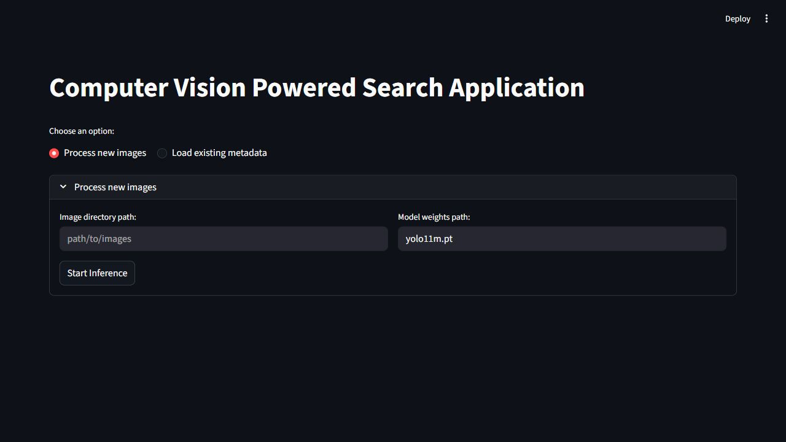
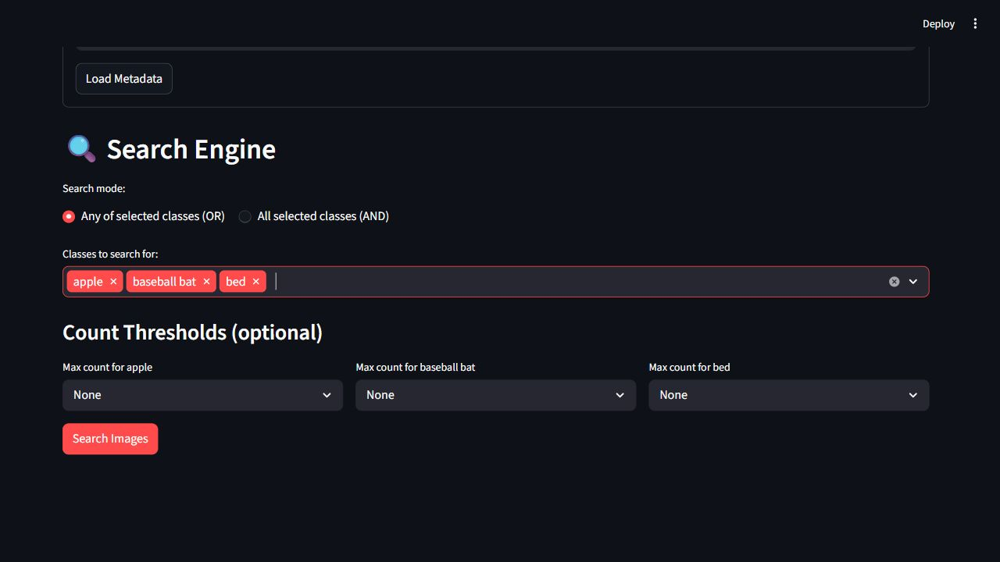
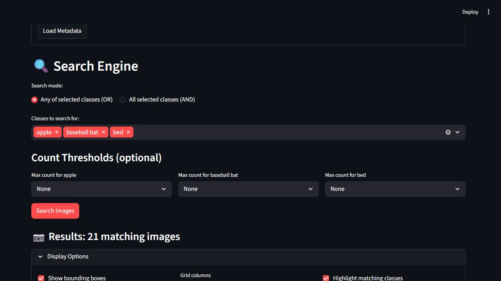
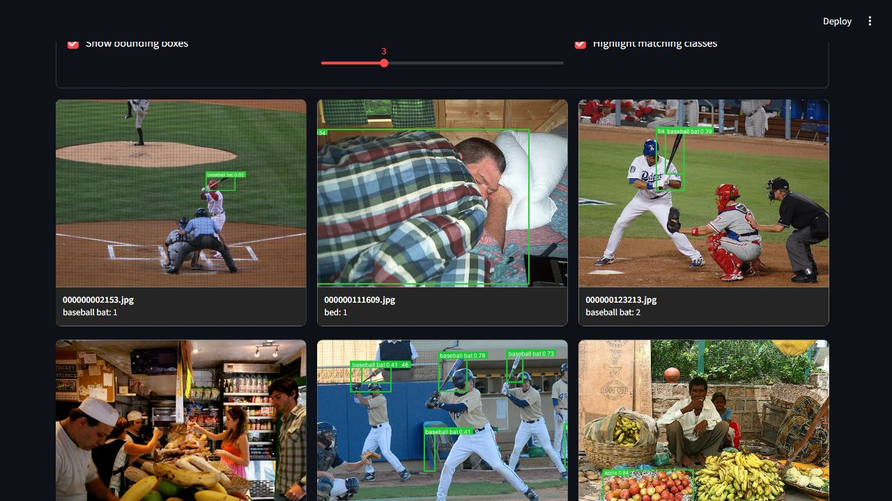

# YOLOv11 Image Search Application

A Streamlit-based computer vision application that uses YOLOv11 object detection to index image collections and make them searchable by detected objects. The application processes images, stores detection metadata, and provides an interactive interface for filtering results by object class and object count.

It is designed for dataset exploration, object detection demonstrations, and visual search workflows where users need to locate images containing specific objects such as `person`, `car`, `apple`, `bed`, or `baseball bat`.

## Preview

### Home



### Search Filters



### Results





## Features

- Run YOLOv11 detection on a folder of images.
- Save detection results into reusable JSON metadata.
- Load existing metadata without running inference again.
- Search images by one or more detected object classes.
- Use `OR` search to match any selected class.
- Use `AND` search to require all selected classes.
- Add optional max-count filters for each selected class.
- Display matching images in a responsive result grid.
- Draw bounding boxes and confidence labels.
- Highlight only the classes used in the search.
- Export matching results as JSON.

## Tech Stack

- Python
- Streamlit
- Ultralytics YOLO
- PyTorch
- Pillow
- PyYAML
- OpenCV headless
- Pandas and NumPy

## Project Structure

```text
Yolov11_Image_search/
|-- app.py
|-- requirements.txt
|-- yolo11m.pt
|-- configs/
|   `-- default.yaml
|-- src/
|   |-- config.py
|   |-- inference.py
|   `-- utils.py
|-- coco-val-2017-500/
|   `-- sample images
|-- data/
|   `-- processed/
|       `-- coco-val-2017-500/
|           `-- metadata.json
|-- docs/
|   `-- screenshots/
|-- Demo/
|   `-- demo.py
`-- test/
    `-- streamlit_basics.py
```

## Core Files

| File | Description |
| --- | --- |
| `app.py` | Main Streamlit interface for processing, searching, displaying, and exporting results. |
| `src/inference.py` | Runs YOLOv11 inference and creates detection metadata. |
| `src/utils.py` | Loads/saves metadata and prepares class/count filter options. |
| `src/config.py` | Loads YAML configuration. |
| `configs/default.yaml` | Stores confidence threshold and supported image extensions. |
| `data/processed/coco-val-2017-500/metadata.json` | Ready-to-use metadata for the included sample images. |
| `coco-val-2017-500/` | Sample image dataset included for validation and demonstration. |

## Requirements

Recommended environment:

- Python 3.11
- 4 GB RAM minimum for small datasets
- NVIDIA GPU optional, but useful for larger datasets

The application can run on CPU. If CUDA-enabled PyTorch is installed, the inference module automatically uses GPU.

## Installation

Clone the repository and move into the project folder:

```bash
git clone <repository-url>
cd Yolov11_Image_search
```

Create a virtual environment:

```bash
python -m venv .venv
```

Activate it on Windows:

```powershell
.\.venv\Scripts\activate
```

Activate it on macOS/Linux:

```bash
source .venv/bin/activate
```

Install dependencies:

```bash
python -m pip install --upgrade pip
pip install -r requirements.txt
```

## Usage

Start Streamlit from the project root:

```bash
streamlit run app.py
```

Open the local URL shown in the terminal, usually:

```text
http://localhost:8501
```

To run on another port:

```bash
streamlit run app.py --server.port 8080
```

## Sample Dataset Workflow

The repository includes sample images and pre-generated metadata, allowing the application to be tested without running inference first.

1. Run the app:

```bash
streamlit run app.py
```

2. Select `Load existing metadata`.
3. Enter this metadata path:

```text
data/processed/coco-val-2017-500/metadata.json
```

4. Click `Load Metadata`.
5. Select classes such as:

```text
apple, baseball bat, bed
```

6. Click `Search Images`.

With the included sample metadata, searching for `apple`, `baseball bat`, and `bed` in OR mode returns 21 matching images.

## Processing Custom Images

To generate metadata for a custom image folder:

1. Select `Process new images`.
2. Enter the image directory path.
3. Enter the model path:

```text
yolo11m.pt
```

4. Click `Start Inference`.
5. Wait for inference to complete.
6. Use the generated metadata in the search interface.

Supported image formats are controlled in `configs/default.yaml`:

```yaml
data:
  image_extension: [".jpg", ".jpeg", ".png"]
```

## Search Modes

| Mode | Behavior |
| --- | --- |
| `Any of selected classes (OR)` | Shows images containing at least one selected class. |
| `All selected classes (AND)` | Shows only images containing every selected class. |

Count thresholds are optional. For example, searching for `person` with a max count of `2` returns images with one or two detected people and excludes images with higher counts.

## Metadata Format

Each processed image is saved as a JSON object like this:

```json
{
  "image_path": "coco-val-2017-500/000000000139.jpg",
  "detections": [
    {
      "class": "person",
      "confidence": 0.83,
      "bbox": [407.7, 157.1, 464.2, 297.0],
      "count": 1
    }
  ],
  "total_objects": 1,
  "unique_class": ["person"],
  "class_counts": {
    "person": 1
  }
}
```

## Configuration

Edit `configs/default.yaml` to tune detection behavior:

```yaml
model:
  yolo_model: "yolo11m.pt"
  conf_threshold: 0.3

data:
  image_extension: [".jpg", ".jpeg", ".png"]
```

Increase `conf_threshold` for fewer, higher-confidence detections. Decrease it to include more possible detections.

## Export Results

After searching:

1. Open `Export Options`.
2. Click `Download Results (JSON)`.

The exported JSON contains only the records that matched the current search.

## Troubleshooting

### `streamlit` command not found

Use:

```bash
python -m streamlit run app.py
```

### Metadata loads but images do not display

Metadata records contain image paths. If images were moved after metadata generation, regenerate the metadata or update the `image_path` values in the JSON file.

### No images are processed

Check that:

- the image folder path is correct
- the folder contains `.jpg`, `.jpeg`, or `.png` files
- the application is being run from the project root

### GPU is not detected

Check CUDA availability:

```bash
python -c "import torch; print(torch.cuda.is_available())"
```

If it prints `False`, install the correct CUDA-enabled PyTorch build for your system.

## Notes

- The included `metadata.json` uses repository-relative image paths for easier setup.
- The included `yolo11m.pt` file is the default model weights file.

## License

No license file is currently included. Add one if you want to define how others can use or modify this project.
